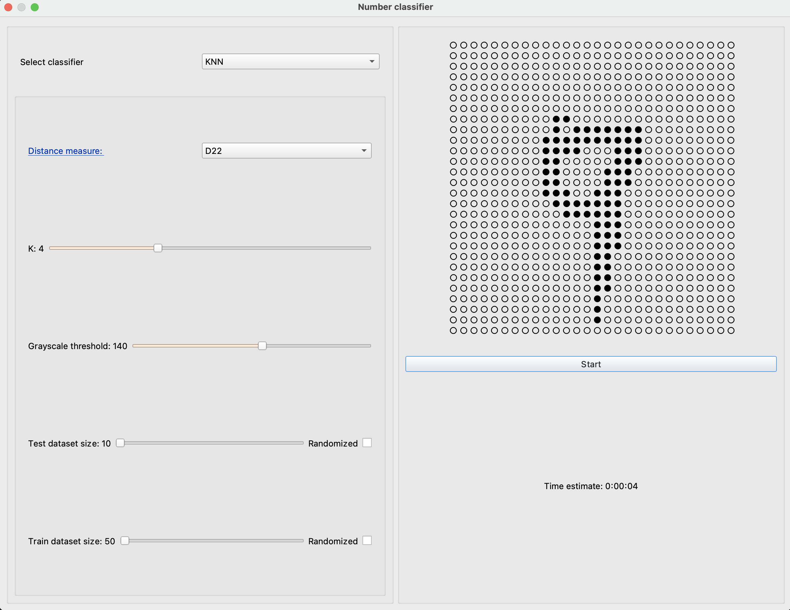
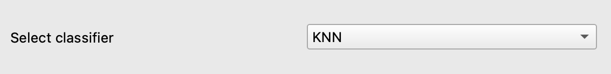
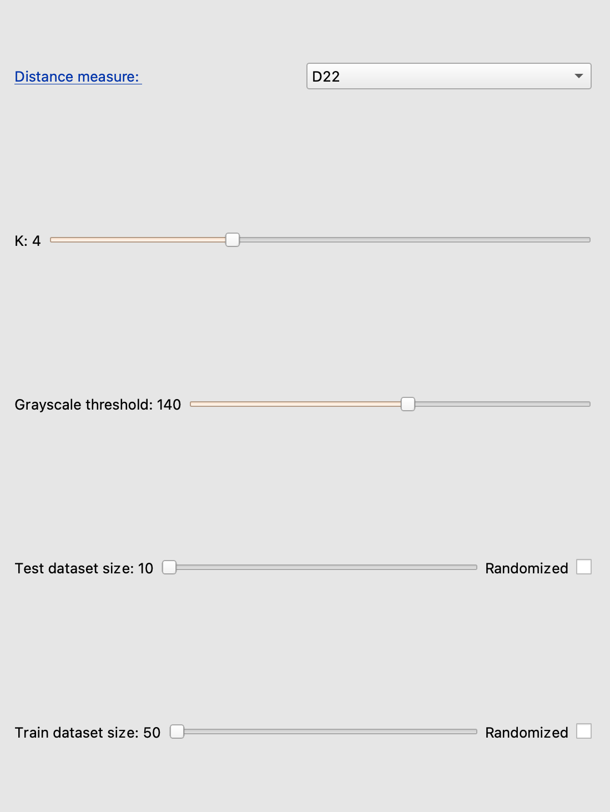
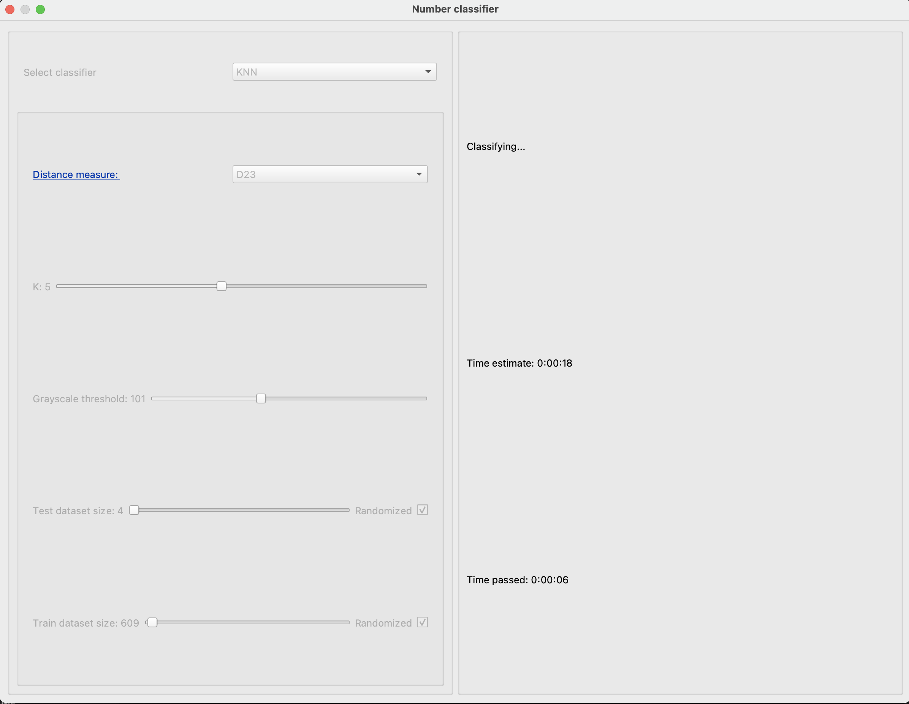
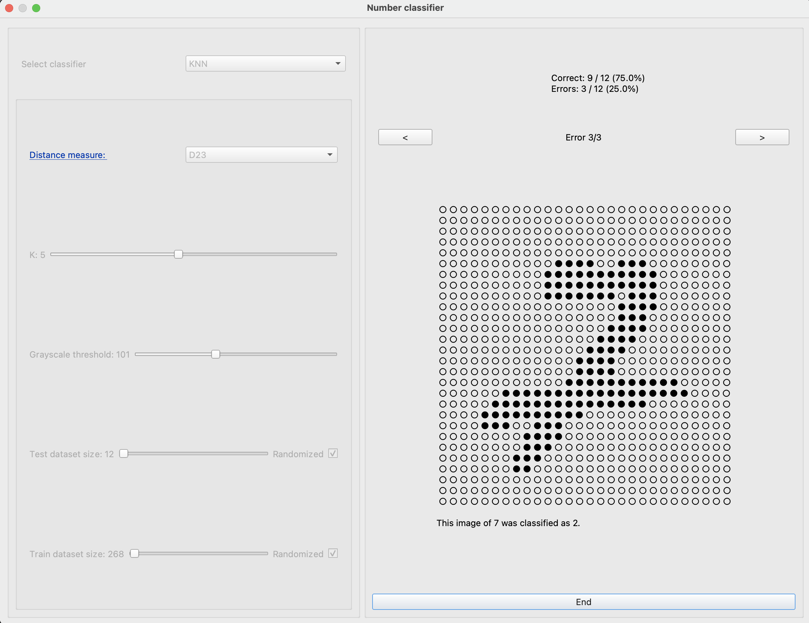

# Käyttöohje

Lataa viimeisin release zip-tiedostona [Releases](https://github.com/yuzamonkey/NumeroidenTunnistus/releases)-osion alta, ja pura zip tiedosto. Vaihtoehtoisesti kloonaa [projekti](https://github.com/yuzamonkey/NumeroidenTunnistus).

## Ohjelman käynnistäminen
Ennen ohjelman käynnistämistä, mene ohjelman juurihakemistoon ja asenna riippuvuudet komennolla:

```bash
poetry install
```

Ohjelma käynnistyy komennolla:
```
python3 src/index.py
```
tai
```
poetry run invoke start
```

## Aloitusnäkymä
Ohjelma käynnistyy seuraavaan näkymään:



## Parametrien valinta



Dropdown valikosta voi valita mitä luokitinta käyttää. Tämän työn palautuksessa on vain k:n lähimmän naapurin menetelmällä toteutettu luokitin.



* Distance measure määrittää miten kahden numeron välinen etäisyys lasketaan. Linkki avaa selaimessa etäisyysmittojen määritelmät.
* K:n arvo määrittää kuinka monta naapuria yhden numeron tunnistamiseen käytetään.
* Grayscale threshold määrittelee kynnyksen harmaasävylle. Kuvien pikseliarvot ovat harmaasävyarvoja välillä 1-255. Käyttäjän syöttämä arvo asetaa kynnyksen, ja vain kynnystä suuremmat arvot otetaan huomioon. Esimerkiksi arvolla 150 otetaan huomioon vain sellaiset pikselit, joiden harmaasävyarvo on suurempaa tai yhtäsuurta kuin 150. Esimerkkikuva päivittyy, kun arvoa muutetaan.
* Test dataset size määrittää kuinka monta numeroa haluaan luokitella. 
* Train dataset size määrittää kuinka montaa numeroa käytetään testattan numeron luokittelemiseksi.
* Randomized-checkbox määrittää, käytetäänkö sattumanvaraisia numeroita, vai datajoukon ensimmäisiä alkioita.

### ⚠
* Sliderit toimivat parhaiten skrollaamalla.
* Ota huomioon aika-arvio. Vaikka sulkisit ikkunan, ohjelma jatkaa taustalla niin pitkään, että luokittelu loppuu.

## Laskenta käynnissä

Start-nappulaa painamalla avautuu seuraava näkymä:



Luokitteluun kuluva aika riippuu käytettävän laitteen tehokkuudesta.

## Tulosnäkymä

Luokittelun jälkeen avautuu seuraava näkymä:



Ohjelma näyttää luokittelun tuloksen prosentteina, sekä kuvat niistä numeroista, joiden luokittelu meni pieleen.
