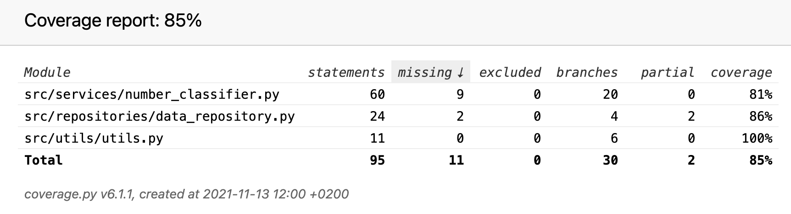

# Testaus
<!-- * Yksikkötestauksen kattavuusraportti.
* Mitä on testattu, miten tämä tehtiin?
* Minkälaisilla syötteillä testaus tehtiin (vertailupainotteisissa töissä tärkeää)?
* Miten testit voidaan toistaa?
* Ohjelman toiminnan empiirisen testauksen tulosten esittäminen graafisessa muodossa. -->

### Kattavuusraportti 13.11.2021

