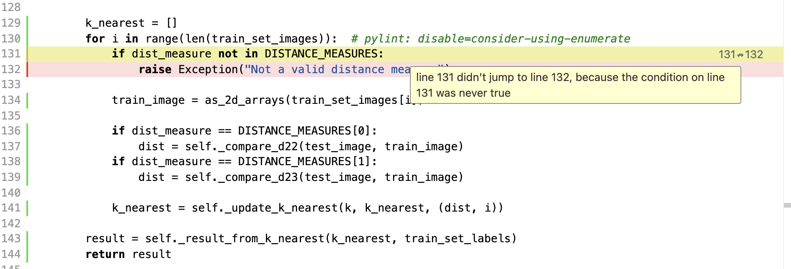

# Viikon 6 raportti

## [Työaikakirjanpito](./worklog.md)

### Mitä olen tehnyt tällä viikolla?

* Lisäsin toiminnallisuuden, jolla voi valita käyttääkö sattumanvaraista treeni- tai testisettiä
* Päivitin koodia ja testejä
* Kirjoitin käyttöohjeen
* Tein releasen

### Miten ohjelma on edistynyt?

* Tämän työn palautukseen oli jo toissa viikolla selvää, että en ehdi toteuttamaan muita menetelmiä k:n naapurin lisäksi. Joten ei suuria muutoksia.

### Mitä opin tällä viikolla?

### Mikä jäi epäselväksi tai tuottanut vaikeuksia?

Pikkujuttu, mutta en ymmärrä miksi testikattavuus laski, vaikka olen kirjoittanut kuvassa olevaan kohtaan testin. 

### Mitä teen seuraavaksi?